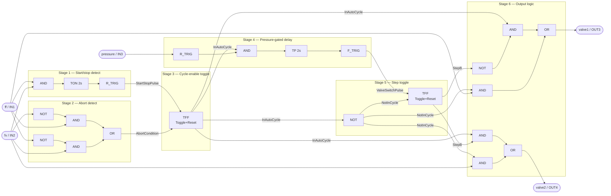

# miCon-L Function Block Wiring Guide — VALVE Logic

Reference for hand-building the control logic from `CLAUDE.md` inside the miCon-L
graphical editor (`$STG-650_TASK` worksheet). Block names below use generic
IEC-style names; likely German-labeled equivalents in the STANDARD library are
noted in parentheses (confirmed from the shipped template: `TG` = Taktgeber /
clock generator, `AV` = Ausschaltverzögerung / off-delay timer — so the palette
uses this naming convention).

## I/O tags
- `ff` = IN1, `fv` = IN2, `pressure` = IN3 (boolean inputs)
- `valve1` = OUT3, `valve2` = OUT4 (boolean outputs)

## Block Diagram

## Stage 1 — Start/stop detection (ff+fv held ≥2s)
| Block | Type (likely German name) | Inputs | Output |
|---|---|---|---|
| AND1 | AND | ff, fv | BothHeld |
| TON1 | On-delay timer (Einschaltverzögerung), PT=2s | IN=BothHeld | Held2s |
| RTRIG1 | Rising-edge / one-shot (Flankenerkennung / Wischrelais) | IN=Held2s | StartStopPulse |

## Stage 2 — Abort detection (either button held alone)
| Block | Type | Inputs | Output |
|---|---|---|---|
| NOT1 | NOT | fv | NotFv |
| AND2 | AND | ff, NotFv | FfAlone |
| NOT2 | NOT | ff | NotFf |
| AND3 | AND | fv, NotFf | FvAlone |
| OR1 | OR | FfAlone, FvAlone | AbortCondition |

## Stage 3 — Cycle-enable toggle
| Block | Type | Inputs | Output |
|---|---|---|---|
| TFF1 | Toggle/impulse relay with reset (Stromstoßrelais) | Trigger=StartStopPulse, Reset=AbortCondition | InAutoCycle |

If no combined toggle+reset block exists, build it manually (see **Fallback** below), feeding it `StartStopPulse` as trigger and `AbortCondition` as reset.

## Stage 4 — Pressure-gated 2s delay
| Block | Type | Inputs | Output |
|---|---|---|---|
| RTRIG2 | Rising edge | IN=pressure | PressureEdge |
| AND4 | AND | PressureEdge, InAutoCycle | GatedPressureEdge |
| TP1 | Pulse timer (Wischrelais), PT=2s | IN=GatedPressureEdge | DelayActive |
| FTRIG1 | Falling edge | IN=DelayActive | ValveSwitchPulse |

`TP1` starts a 2s pulse on each qualifying pressure edge; its falling edge (2s later) is the "switch valves now" trigger — this matches "wait for pressure, then wait 2s" without needing the input held.

## Stage 5 — Step toggle (which valve is active)
| Block | Type | Inputs | Output |
|---|---|---|---|
| NOT3 | NOT | InAutoCycle | NotInCycle |
| TFF2 | Toggle/impulse relay with reset | Trigger=ValveSwitchPulse, Reset=NotInCycle | StepB |

`StepB=0` → Step A (valve1 active); `StepB=1` → Step B (valve2 active). Resetting on `NotInCycle` ensures every new cycle always restarts at Step A/valve1, per spec.

## Stage 6 — Output logic
| Block | Type | Inputs | Output |
|---|---|---|---|
| NOT4 | NOT | StepB | NotStepB |
| AND5 | AND | InAutoCycle, NotStepB | CycleValve1 |
| AND6 | AND | InAutoCycle, StepB | CycleValve2 |
| AND7 | AND | NotInCycle, ff | ManualValve1 |
| AND8 | AND | NotInCycle, fv | ManualValve2 |
| OR2 | OR | CycleValve1, ManualValve1 | **valve1 (OUT3)** |
| OR3 | OR | CycleValve2, ManualValve2 | **valve2 (OUT4)** |

Note: right after an abort (ff or fv held alone), `InAutoCycle` drops to 0 and manual passthrough re-engages on the same scan — if the button that caused the abort is still physically held, its valve will immediately turn on via manual mode. That's expected: "both off" applies to the auto-cycle's own latched state, not to a held button's normal manual action.

## Fallback: toggle-with-reset from SR latch (if no TFF block in palette)
For a toggle output `Q` driven by pulse input `Trig` with priority `Reset`:
- `S = AND(Trig, NOT Q)` (feedback from the latch's own output)
- `R = OR(AND(Trig, Q), Reset)`
- `SR` latch: Set=S, Reset=R → output `Q`

Build this twice — once for `InAutoCycle` (Trig=StartStopPulse, Reset=AbortCondition) and once for `StepB` (Trig=ValveSwitchPulse, Reset=NotInCycle).

## Not yet defined
- Power-up initial state (assume InAutoCycle/StepB reset to 0, i.e. MANUAL, valve1/valve2 off)
- Emergency-stop input, if any
