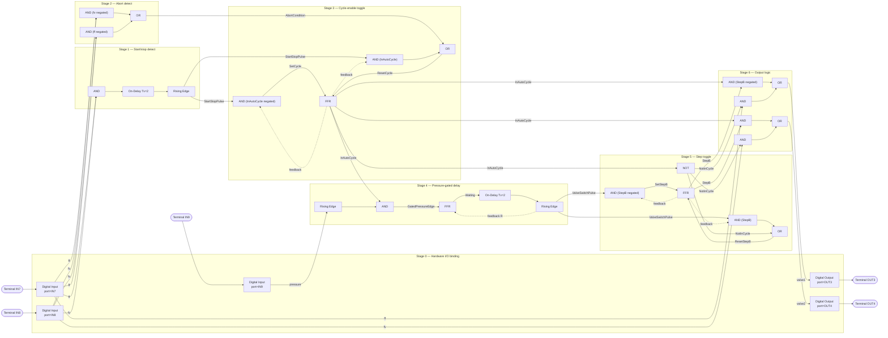

# miCon-L Function Block Wiring Guide — VALVE Logic

Reference for building the control logic from `CLAUDE.md` inside the miCon-L
graphical editor (`$STG-650_TASK` worksheet).

Block names/pins below are confirmed from Barth's own reference
(newsupport.barth-elektronik.com/810986-micon-l → Function Blocks):

| Block | Pins | Notes |
|---|---|---|
| `AND` | P0..P7 (2-8 inputs), Q | any input/output can be negated in the parameter dialog |
| `OR` | P0..P7 (2-8 inputs), Q | any input/output can be negated in the parameter dialog |
| `NOT` | P, Q | only needed when a negated signal must be reused elsewhere; prefer negating a pin on AND/OR directly |
| `On-Delay` | P, Tv (sec, param), Q | delays rising edge of P by Tv; P must stay 1 for the **whole** Tv or Q never fires |
| `Off-Delay` | P, Tv (sec, param), Q | delays falling edge of P by Tv |
| `Rising Edge` | P, Q | 1-scan pulse on P's 0→1 transition |
| `Falling Edge` | P, Q | 1-scan pulse on P's 1→0 transition |
| `Reset Dominant (FFR)` | S, R, Q | if S=R=1, Q→0 (Reset wins) |
| `Set Dominant (FFS)` | S, R, Q | if S=R=1, Q→1 (Set wins) |

**There is no toggle/impulse-relay/T-flip-flop block and no pulse (monoflop) timer** in miCon-L. Both are built below from the primitives above — this is the actual implementation, not a fallback.

## I/O tags
- `ff` = IN7, `fv` = IN8, `pressure` = IN9 (boolean)
- `valve1` = OUT3, `valve2` = OUT4 (boolean)

## Stage 0 — Hardware I/O binding
Confirmed from the official STG-650 hardware manual (Barth doc 9021-0009-A, §5.2.3/§7.1.3):
- **IN1–IN6** are "selectable analog/digital inputs" — either function block (`Digital Input` or `Analog Input`) can read them.
- **IN7–IN10** are pure digital inputs only (up to 1 kHz) — no analog option, so no ambiguity for `Digital Input` block port selection.
- Wiring: thanks to an internal pull-down resistor on every input, any NO/NC switch is wired directly **between the positive supply (VDD) and the input pin** (not to GND) — idle = LOW, closed = HIGH.
- Outputs OUT1–OUT8 are highside solid-state switches, ≤1.5 A each, ≤6 A combined; OUT9 is the lowside PWM output. `valve1`=OUT3 and `valve2`=OUT4 are both plain OUT1–OUT8 type outputs.

`ff`(IN7), `fv`(IN8), and `pressure`(IN9) all fall in the IN7–IN10 pure-digital range, so **all three read directly through the `Digital Input` block**.

| Block | Config | Output |
|---|---|---|
| DIN1 (Digital Input) | port=IN7 | **ff** |
| DIN2 (Digital Input) | port=IN8 | **fv** |
| DIN3 (Digital Input) | port=IN9 | **pressure** |
| DOUT1 (Digital Output) | port=OUT3, P=valve1 signal | drives OUT3 |
| DOUT2 (Digital Output) | port=OUT4, P=valve2 signal | drives OUT4 |

## Toggle-from-pulse pattern (used twice below)
To get a toggle output `Q` from a one-scan trigger pulse `Trig`, with a priority `Reset`:
- `S = AND(Trig, Q negated)` — feed the FFR's own `Q` back into this AND with that pin negated
- `R = OR(AND(Trig, Q), Reset)` — feed `Q` back into this AND un-negated
- `FFR: S=S, R=R → Q`

Reset-dominant (FFR) is used because `Reset` must always win over a coincident toggle pulse.

## Stage 1 — Start/stop detection (ff+fv held ≥2s)
| Block | Inputs | Output |
|---|---|---|
| AND1 | P0=ff, P1=fv | BothHeld |
| ONDELAY1 (On-Delay, Tv=2) | P=BothHeld | Held2s |
| REDGE1 (Rising Edge) | P=Held2s | StartStopPulse |

`BothHeld` is a real level signal (buttons physically held), so On-Delay works directly here — no latch needed.

## Stage 2 — Abort detection (either button held alone)
| Block | Inputs | Output |
|---|---|---|
| AND2 | P0=ff, P1=fv (negated) | FfAlone |
| AND3 | P0=fv, P1=ff (negated) | FvAlone |
| OR1 | P0=FfAlone, P1=FvAlone | AbortCondition |

## Stage 3 — Cycle-enable toggle (InAutoCycle)
Toggle-from-pulse pattern, Trig=StartStopPulse, Reset=AbortCondition:
| Block | Inputs | Output |
|---|---|---|
| AND4 | P0=StartStopPulse, P1=InAutoCycle (negated, feedback) | SetCycle |
| AND5 | P0=StartStopPulse, P1=InAutoCycle (feedback) | ResetCycleFromToggle |
| OR2 | P0=ResetCycleFromToggle, P1=AbortCondition | ResetCycle |
| FFR1 | S=SetCycle, R=ResetCycle | **InAutoCycle** |

## Stage 4 — Pressure-gated 2s delay pulse
No monoflop exists, so a fresh pressure edge is latched into a `Waiting` flag that holds
long enough for an On-Delay to time out, then the delay's rising edge produces the pulse
and clears the latch:
| Block | Inputs | Output |
|---|---|---|
| REDGE2 (Rising Edge) | P=pressure | PressureEdge |
| AND6 | P0=PressureEdge, P1=InAutoCycle | GatedPressureEdge |
| FFR2 | S=GatedPressureEdge, R=ValveSwitchPulse (feedback, see below) | Waiting |
| ONDELAY2 (On-Delay, Tv=2) | P=Waiting | DelayDone |
| REDGE3 (Rising Edge) | P=DelayDone | **ValveSwitchPulse** |

`ValveSwitchPulse` feeds back into `FFR2.R` to clear `Waiting` once used.

## Stage 5 — Step toggle (which valve is active)
Toggle-from-pulse pattern, Trig=ValveSwitchPulse, Reset=NotInCycle:
| Block | Inputs | Output |
|---|---|---|
| NOT1 | P=InAutoCycle | NotInCycle |
| AND7 | P0=ValveSwitchPulse, P1=StepB (negated, feedback) | SetStepB |
| AND8 | P0=ValveSwitchPulse, P1=StepB (feedback) | ResetStepBFromToggle |
| OR3 | P0=ResetStepBFromToggle, P1=NotInCycle | ResetStepB |
| FFR3 | S=SetStepB, R=ResetStepB | **StepB** |

`StepB=0` → Step A (valve1 active); `StepB=1` → Step B (valve2 active). Resetting on `NotInCycle` ensures every new cycle restarts at Step A/valve1.

## Stage 6 — Output logic
| Block | Inputs | Output |
|---|---|---|
| AND9 | P0=InAutoCycle, P1=StepB (negated) | CycleValve1 |
| AND10 | P0=InAutoCycle, P1=StepB | CycleValve2 |
| AND11 | P0=NotInCycle, P1=ff | ManualValve1 |
| AND12 | P0=NotInCycle, P1=fv | ManualValve2 |
| OR4 | P0=CycleValve1, P1=ManualValve1 | **valve1 (OUT3)** |
| OR5 | P0=CycleValve2, P1=ManualValve2 | **valve2 (OUT4)** |

Note: right after an abort (ff or fv held alone), `InAutoCycle` drops to 0 and manual passthrough re-engages on the same scan — if the button that caused the abort is still physically held, its valve turns on via manual mode. That's expected: "both off" applies to the auto-cycle's own latched state, not to a held button's normal manual action.

## Block Diagram

## Project Setup, Build & Download
Confirmed from the shipped `VALVE` template project files (`VALVE.INI`, `VALVE.IWS`):
- Software: miCon-L 7.1 R1
- Target: STG-650 (only 1 program task is possible per the template's own comment)
- Cycle time: 200 ms (`VALVE.IWS` → `cycletime=200`)
- Libraries used: `LIB`, `LIB\STANDARD`, `LIB\STG-650`, `SYSTEM`, `BIN\ADDON`, `LIB\CANLayer2`
- Programmer/interface: VK-16 (USB/TTL232)
- COM port must be set once per project — via the "Extras" menu or the connector icon in the toolbar

Steps:
1. Create/open the project targeting STG-650, single program task (as in the `VALVE` template's `$STG-650_TASK` worksheet).
2. Set the COM port for the VK-16 programmer via Extras → COM-Port Parameter.
3. Build the diagram per Stages 0–6 above on the task worksheet.
4. Compile/build the project in miCon-L.
5. Connect the VK-16 to the STG-650 and download via the connector icon.
6. Use online monitoring (block highlighting) to verify `ff`/`fv`/`pressure` read correctly and `valve1`/`valve2` toggle as expected before connecting real valves.

## Physical Wiring Notes (from STG-650 manual §5.2.3/§5.2.4)
- Wire `ff`, `fv`, and the pressure switch each between **VDD (+)** and their input pin (IN7, IN8, IN9) — not to GND. Internal pull-downs mean idle=LOW, closed=HIGH.
- All inputs are 0–32 VDC tolerant, common GND, no potential isolation.
- OUT3/OUT4 (valve1/valve2) are highside switches: a logic HIGH connects VDD to the output pin. Valve solenoid coils must not exceed 1.5 A each (6 A combined across OUT1–OUT8).

## Not yet defined
- Power-up initial state (assume all FFR latches reset to 0, i.e. MANUAL, valve1/valve2 off)
- Emergency-stop input, if any
